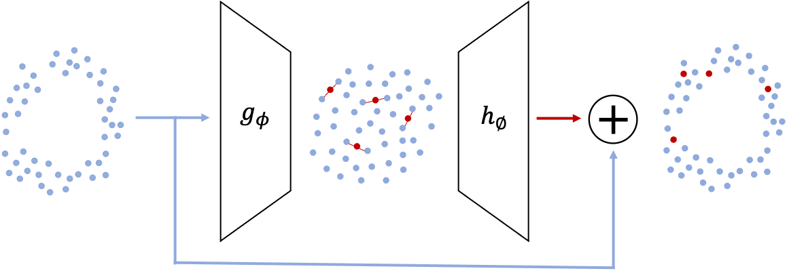

# TAEI - Tabular AutoEncoder Interpolator

## Overview


This library contains implementations of the latent space minority oversampling techniques proposed in [1] for 
multi-modal data. These oversamplers work by

1. Mapping the multi-modal samples to a dense continuous latent space using an autoencoder
2. Applying oversampling by interpolation in the latent space
3. Mapping the synthetic samples back to the original feature space

This framework was shown to be effective in generating high-quality multi-modal synthetic data which then resulted in 
better prediction quality for downstream tasks. 

#### LatentSpaceOversampler
The interpolator is implemented by the class `LatentSpaceOversampler` which takes two inputs:
- `model` - This is the autoencoder used to map the samples to the latent space and back. Currently, two 
autoencoders are provided with the package: `AE` which is a vanilla autoencoder and `VAE` which is a variational 
autoencoder.
- `base_oversampler` - The oversampler applied in the latent space. No oversamplers are provided with this package. We have 
experimented with `SMOTE` from [imbalanced-learn](https://github.com/scikit-learn-contrib/imbalanced-learn) and `polynom_fit_SMOTE` from 
[smote_variants](https://github.com/analyticalmindsltd/smote_variants). Note that the base oversampler controls the 
number of minority samples generated

## Installation
Install from pip
```
pip install sagemaker-scikit-learn-extension[taei]

# For Zsh users: 
pip install sagemaker-scikit-learn-extension\[taei]\
```

## Examples
[imbalanced-learn](https://github.com/scikit-learn-contrib/imbalanced-learn) is required to run the examples below as it provides the dataset and the base oversampler. 
Smote-variants is used for polynom_fit_SMOTE which yield superior prediction quality in our experiments. Install these 
packages by
```
pip install imbalanced-learn==0.7 smote-variants
```

TAEI supports input of either a numpy.ndarray or a pandas.DataFrame object with two types of columns:
- Continuous columns: numeric values, can have very large cardinality
- Discrete (categorical) columns: numeric or string values with low cardinality

Next we load the dataset from [imbalanced-learn](https://github.com/scikit-learn-contrib/imbalanced-learn) and specify 
which columns are continuous and which are discrete
```python
import imblearn.datasets

# load the datasets
d = imblearn.datasets.fetch_datasets()["abalone"]
# indexes of categorical features
categorical_features = [0, 1, 2]
# number of uniques for each categorical feature
categorical_dims = [2, 2, 2]
# indexes of continuous features
continuous_features = [3, 4, 5, 6, 7, 8, 9]
```

### Vanilla autoencoder + SMOTE
We start with an example of wrapping SMOTE with a vanilla autoencoder
```python
from imblearn.over_sampling import SMOTE
from sagemaker_sklearn_extension.contrib.taei import LatentSpaceOversampler, AE

ae_smote = LatentSpaceOversampler(
    model=AE(
        categorical_features=categorical_features,
        categorical_dims=categorical_dims,
        continuous_features=continuous_features,
    ),
    base_oversampler=SMOTE(sampling_strategy=0.5).fit_resample,
)
```
Note that the base oversampler, SMOTE in our case, controls the number of minority samples generated

We train the autoencoder on the training data before using the oversampler
```python
ae_smote.fit(X=d["data"], y=d["target"], verbose=True)
```

Finally, we can oversample the minority class 
```python
# Oversample the minority class
X_oversampled, y_oversampled = ae_smote.resample(X=d["data"], y=d["target"], verbose=True)
```

### Variational autoencoder + PolynomFit
We demonstrate PolynomFit[2] wrapped by a variational autoencoder, a combination yielding superior prediction quality 
in our experiments[1]
```python
from smote_variants import polynom_fit_SMOTE
from sagemaker_sklearn_extension.contrib.taei import LatentSpaceOversampler, VAE

vae_poly = LatentSpaceOversampler(
    model=VAE(
        categorical_features=categorical_features,
        categorical_dims=categorical_dims,
        continuous_features=continuous_features,
    ),
    base_oversampler=polynom_fit_SMOTE(proportion=1.0).sample
)
# Train the model and oversample in a single function call
X_oversampled, y_oversampled = vae_poly.fit_resample(X=d['data'], y=d['target'], verbose=True)
```

## Citing TAEI

If you use TAEI, please cite the following work:
- S. Darabi and Y. Elor "Synthesising Multi-Modal Minority Samples for Tabular Data"

## References
[1] S. Darabi and Y. Elor "Synthesising Multi-Modal Minority Samples for Tabular Data"

[2] Gazzah, S. and Amara, N. E. B., "New Oversampling Approaches Based on Polynomial Fitting for Imbalanced Data Sets", 
2008 The Eighth IAPR International Workshop on Document Analysis Systems, 2008, pp. 677-684
